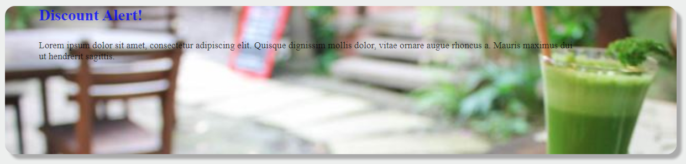
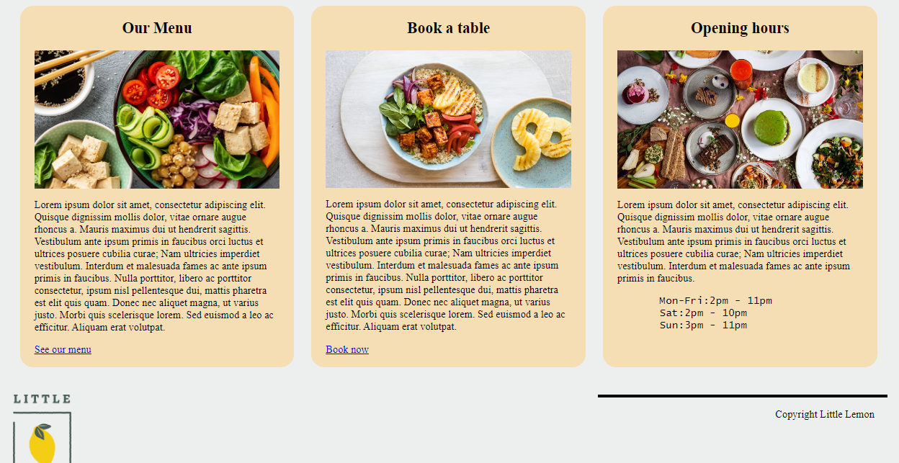

# Little-Lemon-Front-End
This repository contains the HTML and CSS code for the home page of a fictitious client called Little Lemon Cafe. It was a peer graded assignment for a course.

The first task was to add the logo and menu as shown below.

Then, below the menu, there should be a banner that displays updated information about the cafe

Below the banner, there are three columns that present information about the cafe to the customer. 

It was very fascinating experience to explore the capability of HTML and CSS working together that result in a responsive front end design.